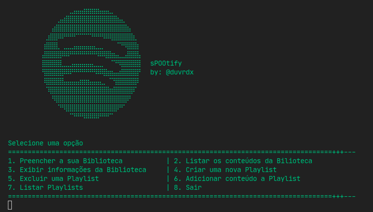

# **sPOOtify**

**Screenshot**
_________________

***EN***
_________________
A project developed in the discipline of Object Oriented Programming, to apply and improve the concepts of Object Orientation.

For the project, we reproduced some of Spotify's concepts, such as creating and managing playlists, adding/removing content, listing the contents present in the playlist.

We refined the code of this project using some design patterns that we learned during the semester.

***PT***
_________________
Um projeto desenvolvido na disciplina de Programação Orientada a Objetos, para aplicar e aperfeiçoar os conceitos de Orientação a Objetos.

Para o projeto reproduzimos alguns dos conceitos do Spotify, como criação e gestão de playlists, adição/remoção de conteúdo, listagem dos conteúdos presentes na playlist.

Refinamos o código deste projeto utilizando alguns padrões de design que aprendemos durante o semestre.
